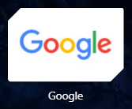
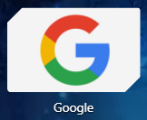

# linkitz

A simple multi-purpose link website.

This is not a link shortener, but a way to customise your shortcuts, specifically Opera GX. Or you can just customise your browser experience by adding an image while browsing.

## URL parameters

We don't make a new page for every single link. Instead we use URL parameters that you can fill in when saving your shortcut.

```https
https://linkitz.web.app/l?thumb=___&image=___&redirect=___&time=___
```

The blanks are where you can input some data to customise your experience! If you have a general idea of how to use them, here's a table showing what each parameter is:

| Parameter   | Description                                                                                                                       |
| ----------- | --------------------------------------------------------------------------------------------------------------------------------- |
| `thumb=`    | This will be hidden, but available in the thumbnail options in Opera. To get an image link, upload to [Imgur](https://imgur.com). |
| `image=`    | When redirecting, you can choose a custom image to display. To get an image link, upload to [Imgur](https://imgur.com).           |
| `redirect=` | Where should you be redirected?                                                                                                   |
| `time=`     | This should be in milliseconds (seconds + 000).                                                                                   |

If you don't know what to do, go [here](https://ipt0t15yybc.typeform.com/to/Yz0az0d8) for a step-by-step form. You can just copy your new link.

## How it works

It may be a bit confusing, with all these cool terms and such. Here's a longer explanation on each component.

### Changing the thumbnail

Opera usually gives you some options to use as a thumbnail on your Speed Dial. Usually, you won't get the thumbnail you want.

For example, this is the icon for Google:



If you want to use a different icon instead, you can use linkitz to create a redirect link that has your desired image as an icon.



Let's take our linkitz link that we'll be using:

```https
https://linkitz.web.app/l?thumb=___&image=___&redirect=___&time=___
```

Take note of the parameters `thumb=` and `redirect=`. The blanks following them are where you'll input your data.

Say we've found a good thumbnail online:

```https
https://expresswriters.com/wp-content/uploads/2015/09/google-new-logo-1030x541.jpg
```


And we want to redirect to Google:

```https
https://www.google.com
```

Now, we can fill in our link with these parameters. We can add our thumbnail to `thumb` and our redirect URL to `redirect`

```https
https://linkitz.web.app/l?thumb=https://expresswriters.com/wp-content/uploads/2015/09/google-new-logo-1030x541.jpg&image=___&redirect=https://www.google.com&time=___
```

(It seems to have gotten a little longer...)

### Adding a redirect image and delay

It usually takes a few seconds to change the thumbnail from Opera GX's default to a better image.

Your normal redirect wouldn't work. So we'll need to stay in the website a little longer.

We'll add a delay to our redirect. If we want to redirect in 5 seconds, we could add that to the URL parameters.

However, it needs to be in milliseconds. So we add:

```int
5000
```

```https
https://linkitz.web.app/l?thumb=___&image=___&redirect=___&time=___
```

We can now fill in our `time` with our delay.

```https
https://linkitz.web.app/l?thumb=___&image=___&redirect=___&time=5000
```

Since a blank white page is a boring thing to look at for 5 straight seconds, we can also add an image to look at.

There's a good image on the internet:

```https
http://www.google.com/logos/doodles/2020/stay-and-play-at-home-with-popular-past-google-doodles-cricket-2017-6753651837108767-2xa.gif
```


We can now add this to the `image` parameter. Our link should now look like this (minus the redirect and thumbnail, since it's too long.)

```https
https://linkitz.web.app/l?thumb=___&image=http://www.google.com/logos/doodles/2020/stay-and-play-at-home-with-popular-past-google-doodles-cricket-2017-6753651837108767-2xa.gif&redirect=___&time=5000
```

### Now we have our link

Let's merge our links together to make a nice Google link that takes 5 seconds to redirect.

```https
https://linkitz.web.app/l?thumb=https://expresswriters.com/wp-content/uploads/2015/09/google-new-logo-1030x541.jpg&image=http://www.google.com/logos/doodles/2020/stay-and-play-at-home-with-popular-past-google-doodles-cricket-2017-6753651837108767-2xa.gif&redirect=https://google.com&time=5000
```

It's long, but we don't need to see the full URL in our shortcut.

You can now add this as a bookmark and change the icon you want, then you can now appreciate a prettier icon. You can use any website, any images, the redirect can take as long as you like.

However, if you want to keep it simple, go [here](https://ipt0t15yybc.typeform.com/to/Yz0az0d8) for a step-by-step form. You can just copy your new link.